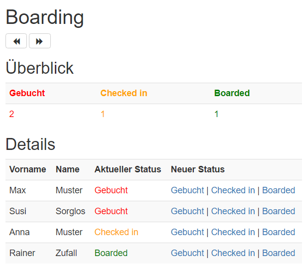
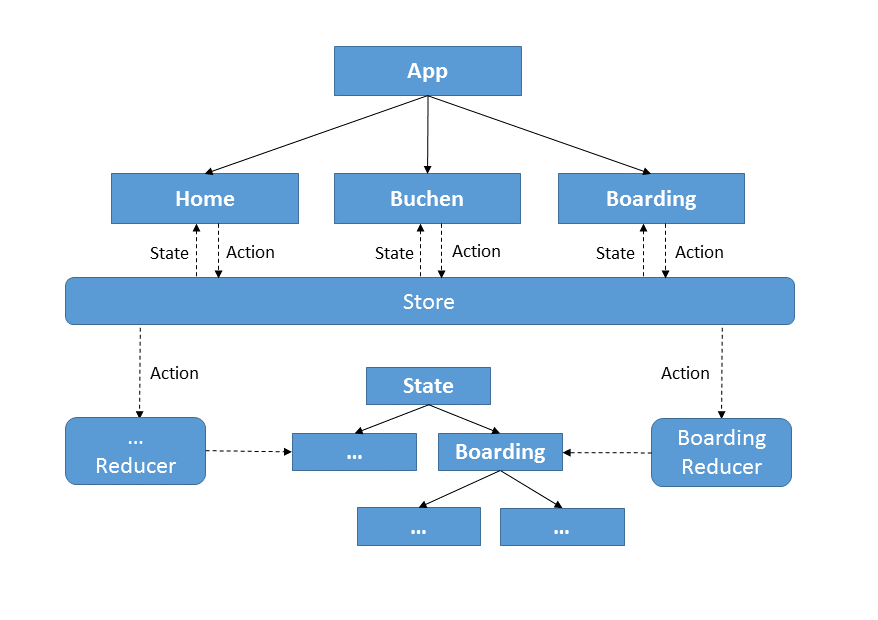

# Beispiel für Angular 2 und @ngrx/Store (Redux)

Dieses Beispiel zeigt die Nutzung der Redux-Implementierung @ngrx/Store für Angular 2 anhand der Verwaltung von Buchungen für Flüge (siehe Ordner **boardig**).

## Installation

Laden Sie nach dem Herunterladen der Quelldateien die nötigen Abhängigkeiten via npm:

```
npm install
```

## Screenshot



## Architektur



Der links angedeutete Reducer kommt in diesem Beispiel nicht vor.